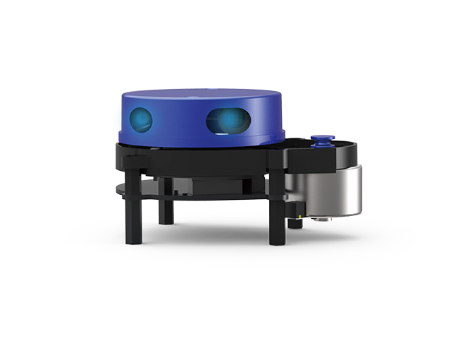
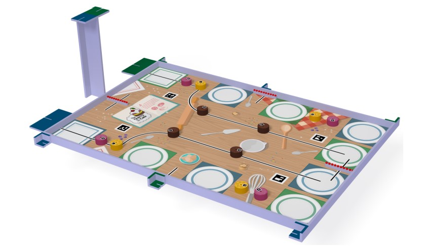
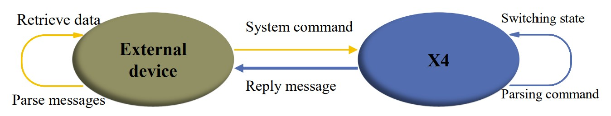
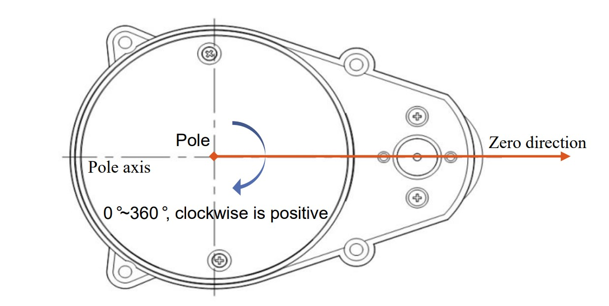

# Lidar French Robotics Cup 2023

## Table of Contents
- [Lidar French Robotics Cup 2023](#lidar-french-robotics-cup-2023)
  - [Table of Contents](#table-of-contents)
  - [Introduction](#introduction)
  - [Context](#context)
  - [YDLIDAR X4](#ydlidar-x4)
    - [YDLIDAR X4 System Modes](#ydlidar-x4-system-modes)
    - [YDLIDAR X4 External Device Interaction](#ydlidar-x4-external-device-interaction)
    - [YDLidar Communication Protocol](#ydlidar-communication-protocol)
  - [Strategy](#strategy)
  - [References](#references)

## Introduction
As a participant in the French Robotics Cup, my student association [Galiléo](https://www.linkedin.com/company/galil%C3%A9o-cpe-lyon/) from [CPE Lyon](https://www.cpe.fr/en/) engineering school has been tasked with the design and construction of a fully autonomous robot capable of performing various tasks within a prescribed time limit. Specifically, my role entails the development of a mechanism to facilitate avoidance of opponents, which will be accomplished through the utilization of a YDLIDAR X4 device.

## Context
The French Robotics Cup is a competition for amateur robotics enthusiasts, including young people in clubs, school groups, or with friends. The aim is to encourage learning and practical application of knowledge through a fun and friendly event. Participants are tasked with building an autonomous robot and optionally, a secondary robot. The 2023 edition of the competition requires robots to complete various tasks such as baking cakes, putting cherries on cakes, putting remaining cherries in a basket, putting wheels in a dish, dressing up for a party, and calculating the bill - all in 100 seconds. More information about the competition can be found on their [website](https://www.coupederobotique.fr/).

## YDLIDAR X4
### YDLIDAR X4 System Modes
The YDLIDAR X4 system offers three modes of operation:

1. __Idle Mode__: The X4 defaults to this mode upon power-up. The ranging unit remains inactive, and the laser is not activated.

2. __Scan Mode__: In this mode, the ranging unit activates the laser and begins to operate. The lidar system continuously performs laser sampling of the surrounding environment, and the output is subjected to background processing in real-time.

3. __Stop Mode__: The X4 automatically switches to this mode in the event of an error during operation. The distance measuring unit powers off, and an error code is transmitted as feedback. Examples of errors include the scanner failing to turn on, the laser being deactivated, or the motor failing to turn.

### YDLIDAR X4 External Device Interaction
The YDLIDAR X4 system interacts with external devices through the use of commands and data sent via the serial port. Upon receiving a system command from an external device, the X4 system parses the command and responds with a corresponding reply message. Depending on the content of the command, the X4 system will switch to the appropriate working status. The external system will then parse the response message to obtain the relevant data.

### YDLidar Communication Protocol
Please refer to the [YDLidar Communication Protocol](YDLidar%20Communication%20Protocol.md) for detailed information.

## Strategy
The primary objective of this project is to create two point models - one to represent the terrain of the French Robotics Cup and the other to correspond with the output of the Lidar - that can be superimposed to distinguish between two categories of points:

- _"Authorized zone"_: The authorized zone will consist of points on the ground that do not correspond to Lidar points.
- _"Forbidden zone"_ : the forbidden zone will consist of points on the ground that do correspond to Lidar points. 

If the robot approaches the forbidden zone, a __Boolean message__ will be transmitted to alert the system, prompting the robot to change direction.

To accurately determine the robot's orientation, the Lidar will be strategically positioned such that the angle 0 direction of the Lidar is aligned with the robot's front. This will allow the robot's rotation to be seamlessly incorporated without necessitating changes to the reference points.

## References
- [YDLIDAR X4 User Manual](https://www.ydlidar.com/download/YDLIDAR%20X4%20User%20Manual.pdf)
- [PythonRobotics](https://github.com/AtsushiSakai/PythonRobotics.git)
- [yd-lidar-x4-python](https://github.com/Neumi/yd-lidar-x4-python.git)